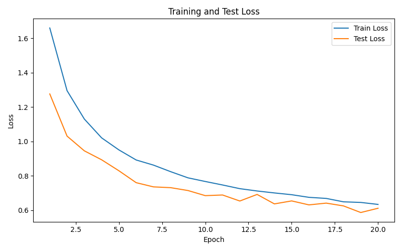
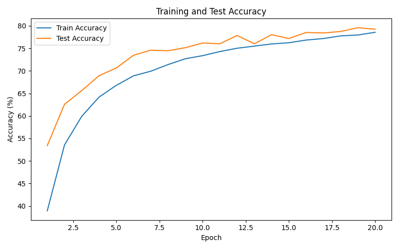
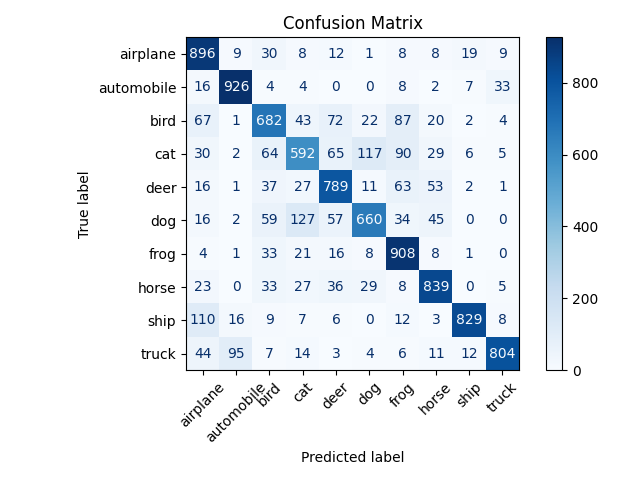

# CIFAR-10 Image Classification with Convolutional Neural Networks

This project implements image classification on the **CIFAR-10 dataset** using a **Convolutional Neural Network (CNN)** built with **PyTorch**.  
The goal of the project is to explore the performance of deep learning models compared to classical machine learning approaches such as **k-Nearest Neighbor (KNN)** and **Nearest Centroid**.

The project includes model training, evaluation, visualization of results, and comparison between different architectures and training strategies.

---

# Dataset

The **CIFAR-10 dataset** consists of:

- 60,000 RGB images
- Image size: **32 × 32 pixels**
- **10 object categories**

Classes included in the dataset:

- airplane
- automobile
- bird
- cat
- deer
- dog
- frog
- horse
- ship
- truck

Dataset split:

- **50,000 training images**
- **10,000 test images**

The dataset is loaded using **Torchvision**.

---

# Project Structure
step1_data.py

Data loading and preprocessing

step2_model.py

CNN architecture definition

step3_train.py

Model training pipeline

step4_eval.py

Model evaluation and metrics

step_knn_comparison.py

Comparison with classical ML classifiers

viz_results.py

Visualization of predictions

results/

accuracy_curve.png
loss_curve.png
confusion_matrix.png

---

# CNN Architecture

The final convolutional neural network consists of the following layers:

Input image
3 × 32 × 32

Layer sequence:

Conv2D (3 → 32) + ReLU
MaxPooling

Conv2D (32 → 64) + ReLU
MaxPooling

Conv2D (64 → 128) + ReLU
MaxPooling

Flatten

Fully Connected (2048 → 256)
ReLU
Dropout

Fully Connected (256 → 10)

The final layer outputs logits for the **10 CIFAR-10 classes**.

---

# Training Configuration

Training was performed using the following parameters:

- Optimizer: **Adam**
- Learning rate: **0.001**
- Batch size: **64**
- Number of epochs: **20**

To improve generalization, **data augmentation** was applied on the training set:

- RandomCrop(32, padding=4)
- RandomHorizontalFlip()

---

# Model Improvements

Three different model configurations were tested:

| Model | Description | Test Accuracy |
|------|-------------|---------------|
| Basic CNN | 2 convolution layers | 72% |
| CNN + Augmentation | 2 conv layers + data augmentation | 75.1% |
| Final CNN | 3 conv layers + augmentation + longer training | **79.25%** |

The results show that both **data augmentation** and **deeper architectures** significantly improve performance.

---

# Comparison with Classical Methods

The CNN model was also compared with traditional machine learning approaches.

| Method | Accuracy |
|------|-----------|
| Nearest Centroid | 28.54% |
| KNN (k = 1) | 31% |
| KNN (k = 3) | 30.22% |
| Final CNN | **79.25%** |

This highlights the advantage of convolutional neural networks in image classification tasks.

---

# Training Curves

Loss and accuracy during training:

---

# Confusion Matrix

Model performance across the different classes:

The confusion matrix shows that the model performs very well on classes such as **automobile, frog, and ship**, while some confusion occurs between visually similar classes such as **cat–dog** and **deer–horse**.

---

# Visualization of Predictions

Random samples from the test set were visualized together with the predicted and true labels in order to qualitatively evaluate model performance.

Examples include both **correct predictions** and **misclassifications**, providing insight into the model's behavior.

---

# Technologies Used

- Python
- PyTorch
- Torchvision
- NumPy
- Matplotlib
- Scikit-learn

---

# Author

**Stavroula Galani**  
Computer Science Student
